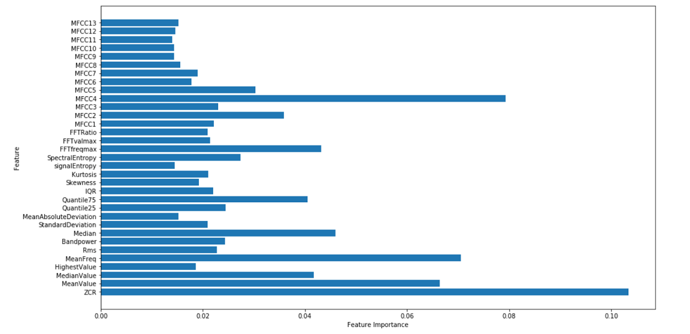
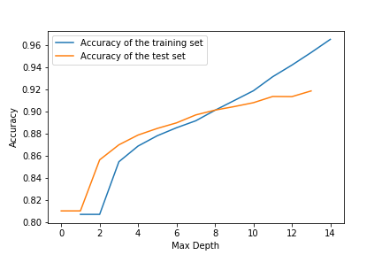

# Phonocardiogram-classification
Random forest approach to detect abnormal heart rhythm from phonocardiogram signals.

In this project the goal is to test how accurate an expert system can identify the normal versus abnormal heart sounds.
The signal used is the phonocardiogram, an record of the sounds made by the heart. For this signal developed a system that uses a set of features 
extracted from heart sounds to train a random forest classifier.
The data used is from [PhysioNet](https://physionet.org/content/challenge-2016/1.0.0/).

## Signal processing:

The signal processing includes the preparation of the raw data and the extraction of the features that will be feed into the 
machine learning model.

### Signal filtering
The first step in order to make the signal ready for feature extraction is to clean as much noise as posible to be left only 
with the functional signal.
Four filters have been used: 
* Butterworth low pass filter with a cut-off frequency of 600 Hz
* Butterworth high pass filter with a cut-off frequency of 25 Hz
* Bandstop filter with cut-off frequency of 59Hz & 61 Hz
* Bandstop filter with cut-off frequency of 49 Hz & 51 Hz

### Signal segmentation
After the signal filtering in order to extract as many relevant features as posible the signal must be segmented in smaller parts.
For this project each cardiac cycle will be considered an segment in which features will be extracted.

### Feature extraction
In the feature extraction step diverse informations that describe the signal will be calculated and used as the entry data in the
model along with the labeled data.
- 33 Features have been extracted
- For a faster training process an feature selection step was made to select the most relevant 15 features

## Results
### Bagging trees with matlab
The model tested is an ensemble method called Bagging trees in which the ideea is to create several subsets of data from the training
sample to train multiple decision trees.
The results of this model in matlab are:

	Accuracy : 0.92

### Random forest with scikit learn
Random Forest is an extension over bagging. It takes one extra step where in addition to taking the random subset of data, 
it also takes the random selection of features rather than using all features to grow trees.

	Feature relevance for the random forest classifier:

	Accuracy for different number of splitter hyperparameter inputs:

		Classification Report

Label	   |precision|   recall  | f1-score 
-----------|---------|-----------|-----
Abnormal   | 0.84    |    0.77   |   0.80    
Normal     | 0.95    |    0.96   |   0.96  

    Accuracy : 0.929

### Hyperparameters Optimization

In order to improve the model chosen one important aspect is to optimize the hyperparameters that define it.
Random forest models have multiple parameters like : 
					                                                        
-criterion                                                   
-max_depth                                                    
-max_features                                                    
-max_leaf_nodes                                                    
-min_impurity_split                                                   
-min_samples_leaf                                                    
-min_samples_split                                                    
-min_weight_fraction_leaf                                                    
-n_estimators                                                   
-max_samples

In order to choose the best values for each the RandomizedSearchCV method is used.
The parameters of the estimator used to apply these methods are optimized by cross-validated search over parameter settings.

After running the hyperparameters tuning tool the best value came as:
{'n_estimators': 400,
 'min_samples_split': 2,
 'min_samples_leaf': 1,
 'max_features': 'auto',
 'max_depth': None,
 'bootstrap': False}

But also the performance of the model improved

Accuracy : 0.933

			Classification Report

              precision    recall  f1-score   

    Abnormal       0.85      0.79      0.82     
      Normal       0.95      0.97      0.96     
    

